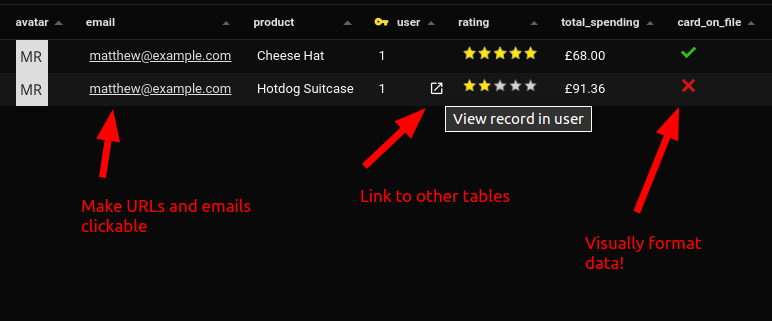
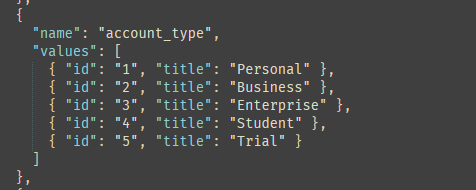
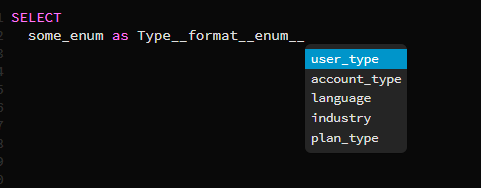
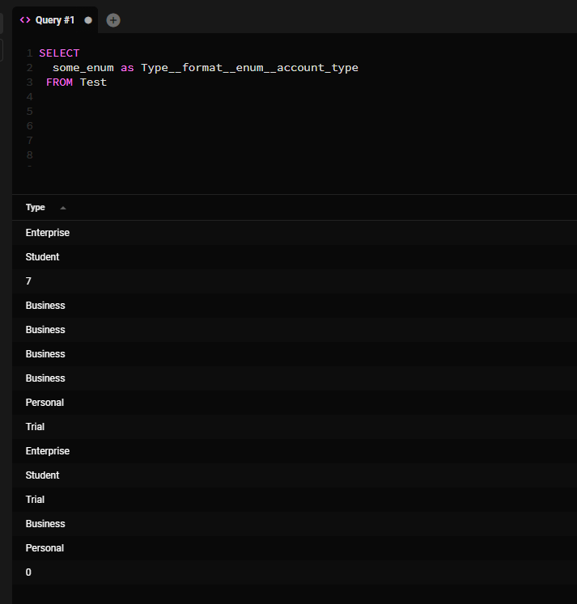

Here's a quick walkthrough on how to use Query Magics.
<iframe width="100%" height="400" src="https://www.youtube-nocookie.com/embed/27xYE423Xqw" title="YouTube video player" frameborder="0" allow="accelerometer; autoplay; clipboard-write; encrypted-media; gyroscope; picture-in-picture" allowfullscreen></iframe>

<br/>





## Use Query Magics to

- Link to another table
- Make urls clickable
- Make email addresses clickable
- Display a url as an image
- Display an number as a star rating
- Display a number as a progress bar
- Display a number as localized money

## How To Use Query Magics

You can format the results of a SQL query by simply adding some text to the end of your column names.

For example, to format the the `url` field as a link you'd do this:

```sql
select url as url__format__link from some_table
```

Here's a quick example that displays clickable emails, links to another table, and renders a number as a star rating.


## Available Query Magics

In all below descriptions the text in square parens is optional.


### Replace values with a custom enum

Replace the values in a column based on user defined enums.

Enums are defined in a file called `enums.json`, which is found in the userData directory.

UserData directory locations:

- Windows: `%APPDATA%\beekeeper-studio`
- Linux: `~/.config/beekeeper-studio`
- MacOS: `~/Library/Application Support/beekeeper-studio`

Make an `enums.json` file in that directory in the format below:

```json
  [
    {
      "name": "user_type",
      "variants": [
        { "id": "1", "value": "Default" },
        { "id": "2", "value": "Admin" },
        { "id": "3", "value": "Editor" },
        { "id": "4", "value": "Viewer" },
        { "id": "5", "value": "Guest" }
      ]
    },
    {
      "name": "account_type",
      "variants": [
        { "id": "1", "value": "Personal" },
        { "id": "2", "value": "Business" },
        { "id": "3", "value": "Enterprise" },
        { "id": "4", "value": "Student" },
        { "id": "5", "value": "Trial" }
      ]
    },
  ]
```

When selecing columns in your query, use the following QueryMagic format

```
select a as  columnname__format__enum__enumname

 --examples
select
  user as user__format__enum__user_type,
  account_id as account__format__enum__account_type
```
In your result table this will replace `id` with `value`. So in the final example, it will replace all values where account_id is `1` with `"Personal"`

Here are the enums in action:







### Format as a clickable link

Make URLs clickable

```
columnname__format__link`
```

### Format as a clickable email address

Similar to links, makes emails clickable - this will open a compose window in your default email client.

```
columname__format__email`
```

### Format as a check/tick
Display a check or cross - 1 for check, 0 for cross. There are no further options

```
columname__format__check
```

### Format as an image (img)

Takes a URL and displays it as an image. You can change the width and height if you like.


```sql
columname__format__image[__width[__height]]

--examples
columname__format__image -- default
columname__format__image__50 -- sets width to 50
columnname__format__image__50__100 -- sets width to 50, height 100
```

### Format as money
Display a number in a specific currency, defaults to USD.

```sql
columname__format__money[__currencyCode]
--examples
columname__format__money      -- USD (the default)
columname__format__money__gbp -- British Pound
columname__format__money__cop -- Colombian Peso

```

### Format as a progress bar

Displays a number as a progress bar, by default this assumes a range of 0 - 100.

```sql
columnname__format__progress[__max]
-- examples
columname__format__progress -- default 0-100
columname__format__progress_10 -- the range is 0-10

```


### Format as a star rating

Displays a number as a star rating (like you would find on a review site). The default assumes a 0-5 star rating.

```sql
columname__format__stars[__max]
--examples
columname__format__stars__10 -- 0-10 stars

```

### Link to another table (goto)

This magic allows you to link to other tables based on the value in your result set, just like how foreign key links work in the table data view.

Your table link can optionally include a column filter.

```sql
columname__goto[__schema]__table[__column] -- syntax
--examples
columname__goto__users -- link to the primary key of the users table
columname__goto__public__users -- link to the primary key of the users table in the public schema
columname__goto__products__user_id -- link to the products table, filter by user_id
```

Because you can provide a filter, you can use this for more than foreign key links. For example you could link to all products purchased by a specific user.

